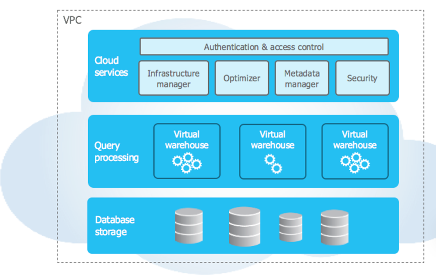

1: Snowflake architecture
2: in which format data is stored in snowflakre partitions
3: what is showflake stages and external tables
4: how to load files from data lang2 to snowflake
5: how to connect snowflake with python code
6: how to optimize snowflake queries
7: How to create task in snowflake pipeline

# Snowflake Architecture
Snowflake’s architecture is a hybrid of traditional shared-disk and shared-nothing database architectures. Similar to shared-disk architectures, Snowflake uses a central data repository for persisted data that is accessible from all compute nodes in the platform. But similar to shared-nothing architectures, Snowflake processes queries using MPP (massively parallel processing) compute clusters where each node in the cluster stores a portion of the entire data set locally. This approach offers the data management simplicity of a shared-disk architecture, but with the performance and scale-out benefits of a shared-nothing architecture.

# Q1: Snowflake architecture

Snowflake’s unique architecture consists of three key layers:

Database Storage
Query Processing
Cloud Services

# 1.Database Storage
When data is loaded into Snowflake, Snowflake reorganizes that data into its internal optimized, compressed, columnar format. Snowflake stores this optimized data in cloud storage.

Snowflake manages all aspects of how this data is stored — the organization, file size, structure, compression, metadata, statistics, and other aspects of data storage are handled by Snowflake. The data objects stored by Snowflake are not directly visible nor accessible by customers; they are only accessible through SQL query operations run using Snowflake.

# 2.Query Processing
Query execution is performed in the processing layer. Snowflake processes queries using “virtual warehouses”. Each virtual warehouse is an MPP compute cluster composed of multiple compute nodes allocated by Snowflake from a cloud provider.

Each virtual warehouse is an independent compute cluster that does not share compute resources with other virtual warehouses. As a result, each virtual warehouse has no impact on the performance of other virtual warehouses.

# 3.Cloud Services
The cloud services layer is a collection of services that coordinate activities across Snowflake. These services tie together all of the different components of Snowflake in order to process user requests, from login to query dispatch. The cloud services layer also runs on compute instances provisioned by Snowflake from the cloud provider.

Services managed in this layer include:

Authentication
Infrastructure management
Metadata management
Query parsing and optimization
Access control

# Connecting to Snowflake
Snowflake supports multiple ways of connecting to the service:
A web-based user interface from which all aspects of managing and using Snowflake can be accessed.
Command line clients (e.g. SnowSQL) which can also access all aspects of managing and using Snowflake.
ODBC and JDBC drivers that can be used by other applications (e.g. Tableau) to connect to Snowflake.
Native connectors (e.g. Python, Spark) that can be used to develop applications for connecting to Snowflake.
Third-party connectors that can be used to connect applications such as ETL tools (e.g. Informatica) and BI tools (e.g. ThoughtSpot) to Snowflake.

# Q2: in which format data is stored in snowflakre partitions
data is stored in compressed columnar format within its internal storage layer. Snowflake does not use explicit partitions like traditional distributed databases (e.g., Hadoop or Spark). Instead, it organizes data into micro-partitions, which are immutable, automatically managed, and optimized for performance.

-- Key Characteristics of Snowflake Data Storage:
Micro-Partitions:

Data is divided into micro-partitions, each typically containing 50-500 MB of uncompressed data.
Each micro-partition is self-contained and stores data for multiple columns in a columnar format.
Micro-partitions are immutable; any data modification results in new micro-partitions being created.
Columnar Storage:

Data within each micro-partition is stored in a columnar format, which enables high compression and fast analytical queries.
Columnar storage is ideal for analytical workloads because it allows selective reading of only the columns required by the query.
Automatic Partitioning:

Snowflake automatically determines how to group data into micro-partitions based on the order in which data is loaded.
It does not require users to define explicit partitioning schemes.
Metadata:

Each micro-partition has metadata that includes:
Minimum and maximum values for each column.
Number of distinct values.
Other statistics for query pruning and optimization.
Snowflake uses this metadata for efficient pruning during query execution, scanning only the relevant micro-partitions.
File Formats:

Internally, Snowflake uses its proprietary storage format for micro-partitions. Users interact with Snowflake through SQL queries and are abstracted from the underlying storage format.
When users load data into Snowflake, they can load it from external file formats such as CSV, JSON, Avro, Parquet, ORC, etc., but Snowflake converts it into its internal format.
Compressed Storage:

Snowflake applies advanced compression algorithms to reduce storage size, optimizing costs and query performance.
Data compression is transparent to users, and Snowflake automatically manages decompression during query execution.
Clustered Data:

While Snowflake does not use traditional partitions, users can define clustering keys on large tables to improve query performance. A clustering key determines how micro-partitions are sorted, improving pruning efficiency.
Benefits of Snowflake's Approach:
No Maintenance: Users do not need to manage partitions explicitly.
Elasticity: Snowflake automatically adjusts to the query and workload needs.
Performance Optimization: Automatic pruning and metadata-driven access speed up query performance.
Transparency: Users interact with Snowflake at a logical level, focusing on queries and analytics rather than managing storage.

# Q3: what is showflake stages and external tables

a "stage" is a designated location where data files are stored before being loaded into a table, and an "external table" is a Snowflake feature that allows you to query data stored in an external stage (like an S3 bucket) as if it were a regular table within Snowflake, without actually loading the data into Snowflake itself; essentially letting you access data from external sources directly through SQL queries. 

Stage types:
There are two types of stages: "internal stages" which store data within Snowflake's internal storage, and "external stages" which reference data stored in external cloud storage like AWS S3 or Azure Blob Storage.

A stage in Snowflake is a storage location used to store data files temporarily before loading them into tables or unloading data from tables. Stages can be internal (managed by Snowflake) or external (e.g., S3, Azure Blob, or GCS).

Internal Stages:

Managed by Snowflake.
Types:
Table Stage: Automatically created for each table.
User Stage: Each user has a personal stage.
Named Stage: Explicitly created and named by users.

External Stages:
Integrates with cloud storage services like AWS S3, Azure Blob Storage, or Google Cloud Storage.
Requires configuring credentials to access the external storage.

Stages are used for data loading (e.g., COPY INTO) and unloading (e.g., COPY INTO <stage>).

External table functionality:
An external table is created by referencing an external stage, allowing you to query the data stored in those external files using standard SQL commands, even though the data remains in its original location. 
Benefits of external tables:
Cost-effective querying: You can access large datasets stored in external cloud storage without needing to load them first into Snowflake, which can save on storage costs. 
Flexibility: You can join data from external sources with data stored in Snowflake tables. 
Data freshness: If new data is added to the external source, you can easily update the external table to reflect the latest information

An external table allows Snowflake to query data stored outside Snowflake (e.g., in S3, Azure Blob, or GCS) without loading it into Snowflake tables.

Key Features:
Data resides in external cloud storage.
Uses Snowflake's SQL to query the external data.
Metadata is stored in Snowflake, while the actual data stays in external storage.
Requires defining the file format (e.g., CSV, Parquet).

Benefits:
Enables querying external data alongside Snowflake-managed data.
Avoids the cost and time of copying large datasets into Snowflake.

# Q4: how to load files from data lang2 to snowflake

https://tezo.com/blog/adls-to-snowflake-using-azure-data-factory/

storage account -> setting -> configuration -> Allow Blob anonymous access -> enabled

-- sotrage level sas token 

CREATE OR REPLACE STAGE my_adlg2_stage
URL = 'azure://zecdatastorage.blob.core.windows.net/raw/'
CREDENTIALS = (AZURE_SAS_TOKEN='sp=racwdle&st=2024-12-06T06:07:07Z&se=2024-12-06T14:07:07Z&spr=https&sv=2022-11-02&sr=c&sig=T%2Bsylp9vTIyDWVruCo%2FJApdbR3w1DwyNjarBI1DIqJ8%3D')
FILE_FORMAT = (TYPE = 'CSV' FIELD_OPTIONALLY_ENCLOSED_BY = '"');

or

# create stage
CREATE STAGE adls_ext_stg 
	URL = 'azure://zecdatastorage.blob.core.windows.net/raw1' 
	CREDENTIALS = ( AZURE_SAS_TOKEN = 'sv=2022-11-02&ss=bfqt&srt=co&sp=rwdlacupyx&se=2024-12-06T17:50:17Z&st=2024-12-06T09:50:17Z&spr=https&sig=y2n8rnEk19cgxd72SatploYmqfUPm84pwMWELNtCw%2Bo%3D' ) 
	DIRECTORY = ( ENABLE = true );

# list stage
LIST @ADLS_EXT_STG;

# create fileformat
CREATE FILE FORMAT csv_type 
    TYPE = 'CSV' 
    SKIP_HEADER = 1 
    FIELD_OPTIONALLY_ENCLOSED_BY = '"'
    FIELD_DELIMITER = ','
    RECORD_DELIMITER = '\n';

# create table 
CREATE OR REPLACE TABLE TEST_DB.TEST_SCHEMA.EMPLOYEE1 (
    ID NUMBER(38,0),
    CITY VARCHAR(16777216),
    TEAM VARCHAR(16777216)
);

# copy data from stage to table
COPY INTO test_db.test_schema.employee1
FROM @ADLS_EXT_STG/emp1.csv
FILE_FORMAT = (FORMAT_NAME = 'csv_type')
ON_ERROR = 'CONTINUE';

or

COPY INTO employee3
FROM @ADLS_EXT_STG/emp1.csv
FILE_FORMAT = (TYPE = CSV FIELD_OPTIONALLY_ENCLOSED_BY = '"' SKIP_HEADER = 1);

# Q5: how to connect snowflake with python code

https://jhpmgzi-xt72971.snowflakecomputing.com/console/login
SHOW WAREHOUSES;
SHOW DATABASES;
SHOW SCHEMAS IN DATABASE TEST_DB;

Snowflake version: 8.45.1

python3.10 -m pip install snowflake-connector-python
-------------------------------------------------------

import snowflake.connector

# Establish the connection
conn = snowflake.connector.connect(
    user='Vajay8679',
    password='Vajay8679@',
    account='jhpmgzi-xt72971',  # e.g., abc12345.us-east-1
    warehouse='COMPUTE_WH',
    database='TEST_DB',
    schema='TEST_SCHEMA'
)

# Create a cursor object
cursor = conn.cursor()

try:
    # Execute a query
    # cursor.execute("SELECT CURRENT_VERSION();")
    cursor.execute("SELECT * from employee1;")

    
    # Fetch results
    # result = cursor.fetchone()
    # print("Snowflake version:", result[0])

    results = cursor.fetchall()

    print("Employee Table Data:")
    for row in results:
        print(row)
    
finally:
    # Clean up
    cursor.close()
    conn.close()

# Q6: how to optimize snowflake queries

1. Optimize Query Design
    Use SELECT Only Required Columns
    Filter Data Early with WHERE Clause
    Use LIMIT to Fetch a Subset

2. Partition and Clustering
    Use clustering keys to organize data physically in a table, improving the efficiency of queries with frequent filtering on specific columns.
    -- ALTER TABLE table_name CLUSTER BY (column1, column2);

    While Snowflake doesn’t use traditional partitions, clustering improves performance for massive datasets.

3. Manage Data Volume
    Avoid Large Joins When Possible
        If possible, reduce the size of tables before joining by filtering data.
            SELECT a.col1, b.col2
            FROM table_a a
            JOIN table_b b ON a.key = b.key
            WHERE a.col3 = 'value' AND b.col4 = 'value';

    Aggregate Before Joining
        If only aggregated results are required, compute aggregates before joins
            SELECT region, SUM(sales) FROM table GROUP BY region;

4. Leverage Snowflake’s Features
    a. Materialized Views
        Use materialized views for frequently queried pre-aggregated data.

        CREATE MATERIALIZED VIEW view_name AS 
        SELECT column1, SUM(column2) AS total FROM table_name GROUP BY column1;

    Result Caching
        Snowflake automatically caches query results. Avoid modifying data during query execution to maximize cache utilization.

5. Optimize Data Storage
    a. Choose the Right File Format
        Use compressed and columnar file formats like Parquet or ORC for loading external data.
    b. Minimize Redundant Data
        Avoid unnecessary duplication in tables; use normalized designs or views when appropriate.

6. Monitor Query Performance
    a. Query Profiling
        Use the Query History view or EXPLAIN command in Snowflake to analyze query performance.
    b. Query Execution Plan
        View query execution steps:
        EXPLAIN USING TEXT SELECT * FROM table_name;
    c. Identify Bottlenecks
        Look for expensive operations like full table scans, large joins, or redundant operations.

7. Manage Virtual Warehouses
    a. Use Appropriately Sized Warehouses
    Scale up for complex queries or scale out for concurrent users.
    Monitor and adjust warehouse sizes:
    ALTER WAREHOUSE warehouse_name SET WAREHOUSE_SIZE = 'LARGE';

    b. Use Auto-suspend and Auto-resume
        Save costs by enabling auto-suspend for inactive warehouses:
        ALTER WAREHOUSE warehouse_name SET AUTO_SUSPEND = 300;

8. Leverage External Tools
    Use BI tools or performance monitoring tools (like Tableau, Looker, or Snowflake's own dashboards) to track and optimize queries.
    Consider query optimization tools to identify unused columns, unused indexes, and excessive complexity.

Example Optimization Process
orignal - 
SELECT * 
FROM sales s
JOIN customers c ON s.customer_id = c.customer_id
WHERE c.region = 'North America';

Optimized Query:
filter early-
SELECT customer_id 
FROM customers 
WHERE region = 'North America';

join reduced dataset-
SELECT s.*
FROM sales s
JOIN (
    SELECT customer_id 
    FROM customers 
    WHERE region = 'North America'
) c_filtered ON s.customer_id = c_filtered.customer_id;

# Q7: How to create task in snowflake pipeline

Creating a task in Snowflake's pipeline involves defining scheduled or event-driven operations that execute SQL statements. Tasks are used to automate workflows such as data ingestion, transformation, or loading. Here's how you can create and manage tasks in Snowflake:

Automate Your SQL Execution with Snowflake Tasks

Snowflake tasks allow you to automate the execution of Snowflake SQL statements, stored procedures, and UDFs on a scheduled basis. They are useful for automating repetitive data management and ELT processes in Snowflake. Snowflake tasks provide a framework for scheduling multi-step data transformations, loading data incrementally, maintaining data pipelines, and ensuring downstream data availability for analytics and applications.

# Here are some key things to know about Snowflake Tasks:

Snowflake tasks allow you to automate Snowflake SQL statements, stored procedures, data load operations—and a whole lot more.
Only one Snowflake  SQL statement is allowed per Snowflake tasks.
Snowflake tasks support dependencies, so you can chain together a sequence of operations.
Snowflake tasks can be monitored in real-time as they execute. You can view Snowflake tasks history, status, and results within Snowflake.
Permissions on Snowflake tasks allow you to control who can create, modify, run, or view them.
Snowflake handles all task dispatching, parallelism, queuing, and retry handling.
Snowflake tasks auto-scale across your Snowflake compute.
Common use cases for Snowflake tasks include ELT processes/pipelines, refreshing materialized views, schedule queries to update dashboards, and orchestrating multi-step workflows.

# Here is a step-by-step process for creating a Snowflake task:

1. CREATE SCHEMA TEST_DB.task_demo;

2. CREATE OR REPLACE TABLE TEST_DB.task_demo.employee (
    ID NUMBER(38,0),
    NAME VARCHAR(55)
);

3. CREATE TASK task_demo.ingest_data
  WAREHOUSE = COMPUTE_WH
  SCHEDULE = '1 minute'
  AS 
  -- SQL statement
    INSERT INTO employee VALUES (1, 'Ajay');

-- to start task
ALTER TASK ingest_data RESUME;

-- to stop task
ALTER TASK ingest_data SUSPEND;

-- start warehosue
ALTER WAREHOUSE COMPUTE_WH RESUME;

-- to check task history
SELECT * FROM TABLE(INFORMATION_SCHEMA.TASK_HISTORY()) 
WHERE NAME = 'INGEST_DATA'

select * from snowflake.account_usage.task_history where name = 'INGEST_DATA';

Types of scheduling mechanisms:
1) Interval-based scheduling or NON-CRON notation
NON-CRON notation allows interval-based scheduling. You specify a fixed time interval at which the task should run.

For example, run every 60 minutes:

SCHEDULE = '60 minute'
-------------------------
CREATE TASK task_demo.ingest_data
  WAREHOUSE = COMPUTE_WH
  SCHEDULE = '1 minute'
  AS 
  -- SQL statement
    INSERT INTO employee VALUES (1, 'Ajay');

2) CRON notation (Time-based scheduling)
CRON notation provides powerful, time-based scheduling. You can specify a particular time for the task to be executed.

The syntax is:

SCHEDULE = 'USING CRON * * * * * UTC'
SCHEDULE = 'USING CRON * 11 * * MON UTC' # run at 11 AM UTC every Sunday:

CREATE TASK task_demo.ingest_data
  WAREHOUSE = COMPUTE_WH
  SCHEDULE = 'USING CRON * * * * * UTC'
  AS 
  -- SQL statement
    INSERT INTO employee VALUES (2, 'Amit');

1) Serverless Snowflake Tasks
With serverless Snowflake tasks, Snowflake automatically manages the compute resources required. You don't have to specify a warehouse.

CREATE TASK my_serverless_task
  SCHEDULE = '60 minute'
AS 
  -- Snowflake SQL statement (Automate SQL)

You can control initial warehouse size using the USER_TASK_MANAGED_INITIAL_WAREHOUSE_SIZE parameter.

CREATE TASK my_serverless_task  
  USER_TASK_MANAGED_INITIAL_WAREHOUSE_SIZE = 'XSMALL'   
  SCHEDULE = '60 MINUTE' 
AS 
  -- Snowflake SQL statement (Automate SQL)

2) User Managed Tasks
With user managed Snowflake tasks, you specify an existing virtual warehouse when creating the task. This allows you full control over the compute resources.

For example:

CREATE TASK my_task
  WAREHOUSE = my_wh
  SCHEDULE = '60 minute'
AS
  -- Snowflake SQL statement (Automate SQL)

-- show task
SHOW TASKS;

# Example of a Snowflake Task Tree for an ETL Pipeline:

--table

CREATE OR REPLACE TABLE TEST_DB.TASK_DEMO.raw_data (
    ID NUMBER(38,0),
    CITY VARCHAR(55),
    TEAM VARCHAR(55)
);

CREATE OR REPLACE TABLE TEST_DB.TASK_DEMO.transformed_data (
    ID NUMBER(38,0),
    CITY VARCHAR(55),
    TEAM VARCHAR(55)
);

CREATE OR REPLACE TABLE TEST_DB.TASK_DEMO.prod_table (
    ID NUMBER(38,0),
    CITY VARCHAR(55),
    TEAM VARCHAR(55)
);

--stage

CREATE or replace STAGE adls_ext_stg5
	URL = 'azure://zecdatastorage.blob.core.windows.net/raw1' 
	CREDENTIALS = ( AZURE_SAS_TOKEN = 'sv=2022-11-02&ss=bfqt&srt=co&sp=rwdlacupyx&se=2024-12-09T13:30:48Z&st=2024-12-09T05:30:48Z&spr=https&sig=ewe2TMaGHb9WpjtNXjI1mFvZQoAE17nDZAL45Rd2cXQ%3D' ) 
	DIRECTORY = ( ENABLE = true );

--list

LIST @adls_ext_stg5;

--create file type

CREATE FILE FORMAT csv_type4
    TYPE = 'CSV' 
    SKIP_HEADER = 1 
    FIELD_OPTIONALLY_ENCLOSED_BY = '"'
    FIELD_DELIMITER = ','
    RECORD_DELIMITER = '\n';

-- task -create first then run and then suspend and then run third, second and then first 

CREATE OR REPLACE TASK load_raw_data
  WAREHOUSE = COMPUTE_WH
  SCHEDULE = 'USING CRON * * * * * UTC' -- runs hourly
AS 
  COPY INTO raw_data 
  FROM @ADLS_EXT_STG5/emp1.csv
  FILE_FORMAT = (FORMAT_NAME = 'csv_type4')
  ON_ERROR = 'CONTINUE';

CREATE or replace TASK transform_data
  WAREHOUSE = COMPUTE_WH
  AFTER load_raw_data
AS
  INSERT INTO transformed_data
  SELECT ID, CITY, TEAM
  FROM raw_data;  

CREATE or replace TASK load_production 
  WAREHOUSE = COMPUTE_WH
  AFTER transform_data
AS
  INSERT INTO prod_table
  SELECT * FROM transformed_data;  

--run task

ALTER TASK load_raw_data RESUME;
ALTER TASK transform_data RESUME;
ALTER TASK load_production RESUME;

--suspend task

ALTER TASK load_raw_data SUSPEND;
ALTER TASK transform_data SUSPEND;
ALTER TASK load_production SUSPEND;

SELECT * FROM TABLE(INFORMATION_SCHEMA.TASK_HISTORY()) 
WHERE NAME = 'LOAD_RAW_DATA'

SELECT * FROM TABLE(INFORMATION_SCHEMA.TASK_HISTORY()) 
WHERE NAME = 'TRANSFORM_DATA'

SELECT * FROM TABLE(INFORMATION_SCHEMA.TASK_HISTORY()) 
WHERE NAME = 'LOAD_PRODUCTION'

show TASKS;

SHOW WAREHOUSES;

ALTER WAREHOUSE COMPUTE_WH RESUME;

DROP stage IF EXISTS ADLS_EXT_STG5;

DROP task IF EXISTS load_raw_data;
DROP task IF EXISTS transform_data;
DROP task IF EXISTS load_production;

SHOW TASKS LIKE 'transform_data';

delete from raw_data;
delete from TRANSFORMED_DATA;

EXECUTE TASK load_raw_data;
  
select * from raw_data;

------------------------------------------------------------------------------
one another example of datapipeline in snowflake
------------------------------------------------------------------------------

--drop database if required
drop database if exists ramu;
--Create Database
create database if not exists ramu;
--use the database
use ramu;

// Prepare table
CREATE OR REPLACE TABLE video_demo (
    ID INT AUTOINCREMENT START = 1 INCREMENT =1,
    NAME VARCHAR(40) DEFAULT 'DemoYoutube',
    CREATE_DATE timestamp);
    
// Prepare table
CREATE OR REPLACE TABLE video_demo_child (
    ID INT,
    NAME VARCHAR(40) ,
    CREATE_DATE timestamp);

create or replace procedure read_result_set2()
  returns string not null
  language javascript
  as     
  $$  
    var my_sql_command = "INSERT INTO video_demo(CREATE_DATE) VALUES(CURRENT_TIMESTAMP)";
    var statement1 = snowflake.createStatement( {sqlText: my_sql_command} );
    var result_set1 = statement1.execute();
    return "Successfully Executed"
  $$
  ;

CREATE OR REPLACE TASK INSERT_Data_with_one_min_interval
    WAREHOUSE = COMPUTE_WH
    SCHEDULE = '1 MINUTE'
    AS call read_result_set2()
    ;

ALTER TASK INSERT_Data_with_one_min_interval RESUME;

select * from video_demo;

ALTER TASK INSERT_Data_with_one_min_interval SUSPEND;

CREATE OR REPLACE TASK INSERT_Data_with_one_min_interval_child
    WAREHOUSE = COMPUTE_WH
    AFTER INSERT_Data_with_one_min_interval
    AS Insert into video_demo_child select * from video_demo;

// Task starting and suspending

ALTER TASK INSERT_Data_with_one_min_interval_child SUSPEND;
ALTER TASK INSERT_Data_with_one_min_interval RESUME;

select * from video_demo;

select * from video_demo_child;
